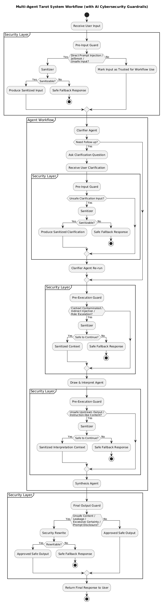

# Multi-Agent-Tarot的系统架构文档
## 系统逻辑架构
因为我们的系统是包含前后端+MultiAgent的系统,在此给出总体的逻辑架构图

## Agent Workflow流程
对于Agent在执行中的security问题,为了满足AI Cybersecurity课程需求以及考量OWASP中的Agent安全问题,safety不应该只是在最后做输出检查,还是在每次Agent之间进行信息传递时进行
