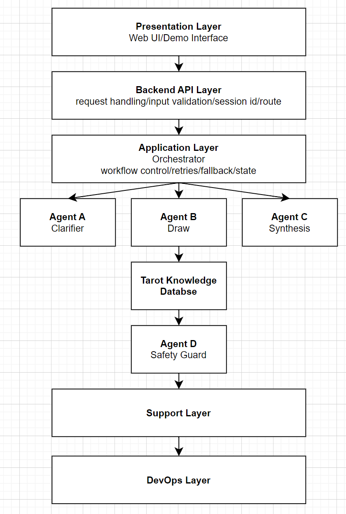

# Multi-Agent-Tarot 系统架构说明

## 1. 文档目标

本文档用于完成 `docs/05-Backend-Build-Plan.md` 中“补全文字版系统架构说明”的阶段 0 交付。

当前仓库只有一张逻辑架构图，但真正可编码的后端实现还缺少文字化约束。本文档负责把系统中的层次、边界、主链路和非目标明确下来，避免后续编码时把 API、工作流、Agent、存储和观测混成一层。

## 2. 当前仓库真相

截至当前磁盘状态：

- `backend/`、`agent/`、`prompts/`、`evals/`、`Docker/` 只有占位目录
- 真实已冻结的信息主要来自 `README.md`、`docs/02-Develop-Guide.md`、`docs/05-Backend-Build-Plan.md`
- 因此本阶段的重点不是优化现有实现，而是先冻结架构契约

## 3. 逻辑架构图

项目已有的逻辑架构图如下：



这张图负责表达“有哪些模块”，但还不足以指导编码。阶段 0 补充的文字约束如下。

## 4. 架构目标

系统目标不是“算命自动机”，而是一个面向自我反思与结构化建议的多智能体系统。

因此后端架构必须满足以下要求：

- 能稳定接住前端输入并完成同步主链路
- 能把 Clarifier、Draw and Interpret、Synthesis、Safety Guard 拆成职责单一的模块
- 能落库会话、结果和 trace 摘要，支持调试和课程展示
- 能在模型输出异常时做结构校验、有限重试和安全降级
- 能在不引入重型基础设施的前提下保持后续可扩展性

## 5. 分层架构冻结

### 5.1 总体分层

| 层级 | 主要职责 | 本期落地方式 | 不负责的事情 |
| --- | --- | --- | --- |
| Presentation Layer | 页面交互、表单收集、结果展示 | 由 `frontend/` 承担 | 不直接调用模型、不拼接业务结果 |
| Backend API Layer | HTTP 接入、参数校验、错误码、资源序列化 | FastAPI 路由层 | 不做工作流编排和数据库细节 |
| Application Layer | 工作流推进、状态流转、重试、fallback、应用服务 | `backend/app/application/` | 不处理 HTTP 协议细节 |
| Agent Layer | Clarifier、Draw、Synthesis、Safety Guard 的单一能力实现 | `agent/agents/` | 不直接访问前端页面或 API 路由 |
| Knowledge Layer | 卡牌元数据与牌义静态资源 | `agent/resources/` | 首期不做独立知识库服务 |
| Storage Layer | 会话、消息、阅读结果、安全审查、trace 摘要存储 | PostgreSQL | 不存 Prompt 模板、不存整份日志 |
| Support Layer | 配置、Model Gateway、日志、观测 | `backend/app/infrastructure/` | 不承载领域业务规则 |
| DevOps Layer | Docker、CI、环境模板、迁移基础设施 | `Docker/`、`.github/workflows/` | 首期不做多环境部署平台 |

### 5.2 职责边界

#### Frontend UI

- 收集用户问题
- 呈现澄清问题和最终结果
- 调用 `Backend API`
- 不直接访问模型或数据库

#### Backend API

- 负责 HTTP 协议、请求体验证、响应序列化、错误码映射
- 只依赖应用服务接口，不直接操作 Agent 内部细节
- 统一暴露 `/api/v1` 资源

#### Orchestrator / Application Service

- 接收 API 层命令
- 按状态机推进 Clarifier、Draw、Synthesis、Safety Guard
- 统一处理重试、fallback 和 trace 记录
- 负责事务边界和存储协调

#### Agent

- 每个 Agent 只处理一个明确能力
- 输入输出必须结构化
- Prompt 不内嵌在业务代码里
- 不直接知道 HTTP、数据库表结构、前端页面状态

#### Model Gateway

- 统一封装 OpenAI 或未来模型提供商
- 统一处理超时、重试、调用日志和模型参数
- 对上游暴露稳定接口，不让 Agent 直接耦合 SDK

#### Storage

- PostgreSQL 只保存业务事实
- Prompt 文件保存在 `prompts/`
- 完整运行日志保存在结构化日志系统
- LLM 调用观测交给 Langfuse

## 6. 运行时组件关系

阶段 0 冻结的主链路如下：

```text
End User
-> Frontend UI
-> Backend API
-> Application Service / Orchestrator
-> Clarifier Agent
-> Draw and Interpret Agent
-> Synthesis Agent
-> Safety Guard Agent
-> PostgreSQL + Trace Logging + Langfuse
-> Backend API Response
-> Frontend UI
```

### 6.1 单次调用模式

单次调用模式对应 `POST /api/v1/readings`。

- 前端一次性提交用户问题
- 后端同步跑完整条主链路
- 后端返回最终结果、风险等级和 trace 摘要
- 该模式优先服务后端独立联调和课程演示

### 6.2 会话模式

会话模式对应 `sessions` 相关接口。

- 用户先创建会话
- 提交问题后，Clarifier 判断是否需要澄清
- 用户按需补充答案
- 状态到达 `READY_FOR_DRAW` 后再执行完整阅读流程

会话模式是阶段 2 的目标，但其状态机和接口必须在阶段 0 先冻结。

## 7. 主链路详细说明

### 7.1 Clarifier

输入：用户原始问题。
输出：归一化问题，以及“是否需要继续澄清”的判断。

设计要求：

- 问题足够明确时，直接进入 `READY_FOR_DRAW`
- Clarifier 自身失败时，不阻塞主链路，而是带 warning trace 回退到原始问题

### 7.2 Draw and Interpret

输入：归一化问题、牌阵类型、塔罗静态知识。
输出：三张牌、每张牌的位置、正逆位和单牌解释。

设计要求：

- 输出必须可被 schema 严格校验
- 首期只支持三张牌反思牌阵
- 首期不引入独立随机服务或知识库服务

### 7.3 Synthesis

输入：归一化问题和三张牌解释。
输出：综合洞察、行动建议、反思问题。

设计要求：

- 输出必须保持结构化
- 若字段缺失或结构非法，先执行一次修复性重试

### 7.4 Safety Guard

输入：完整综合结果。
输出：风险等级、动作决策和安全版最终输出。

设计要求：

- 高风险内容不能直接下发给前端
- 允许动作：直接通过、重写、阻断并返回保护性结果
- 安全动作必须可追踪

## 8. 工作流状态机

阶段 0 冻结的状态机如下：

```text
CREATED
-> QUESTION_RECEIVED
-> CLARIFYING
-> READY_FOR_DRAW
-> DRAW_COMPLETED
-> SYNTHESIS_COMPLETED
-> SAFETY_REVIEWED
-> COMPLETED

异常终态:
-> SAFE_FALLBACK_RETURNED
-> FAILED
```

状态解释：

- `CREATED`：会话已创建，尚未提交问题
- `QUESTION_RECEIVED`：问题已接收并进入 Clarifier 判断
- `CLARIFYING`：需要用户补充信息
- `READY_FOR_DRAW`：输入充分，可以开始抽牌和解读
- `DRAW_COMPLETED`：抽牌与单牌解释已完成
- `SYNTHESIS_COMPLETED`：综合结果已生成
- `SAFETY_REVIEWED`：安全审查已结束
- `COMPLETED`：正常返回最终结果
- `SAFE_FALLBACK_RETURNED`：返回安全降级结果
- `FAILED`：不可恢复失败

详细转移规则和持久化影响见 `docs/06-Backend-Contract-Freeze.md`。

## 9. 数据归属与真相源

为避免后续实现把职责混层，阶段 0 明确以下真相源：

- Prompt 真相源：`prompts/` 下的版本化文件
- 塔罗知识真相源：`agent/resources/` 下的静态 YAML 或 JSON 资源
- 业务事实真相源：PostgreSQL 中的 `sessions`、`readings`、`reading_cards` 等表
- 调试与演示证据：结构化 JSON logs 和 `trace_events`
- 模型调用观测：Langfuse

明确不做的事情：

- 不把 Prompt 直接塞进数据库
- 不把完整原始日志塞进 PostgreSQL
- 不在阶段 0 引入向量数据库、消息队列、插件市场

## 10. 目录落位约束

为了和 `docs/05-Backend-Build-Plan.md` 保持一致，阶段 1 以后应按如下职责落位：

```text
backend/
  app/
    api/
    application/
    domain/
    schemas/
    infrastructure/
    tests/
agent/
  agents/
  workflows/
  schemas/
  resources/
prompts/
evals/
Docker/
```

目录存在两个关键边界：

- `backend/` 负责后端服务和工程化壳层
- `agent/` 负责多智能体工作流和能力实现

这样做的目的是让 API 协议、应用编排和 Agent 能力拆分清楚，符合单一职责原则。

## 11. 首期非目标

以下内容明确不属于阶段 0 到阶段 2 的必做范围：

- 复杂用户鉴权与权限体系
- 多租户隔离
- 大规模高并发部署
- 自训练模型
- 独立知识库服务
- 事件总线、任务队列、分布式调度
- Kubernetes、Helm、多环境部署系统

## 12. 架构决策总结

阶段 0 后，后端架构的最小可执行结论是：

- 前端只和 FastAPI 交互
- FastAPI 只负责协议与校验
- 工作流推进统一由应用层编排
- Agent 必须结构化输入输出
- Postgres 只存业务事实，日志和 Prompt 分别归位
- 所有实现都必须遵守统一状态机和 schema 契约
