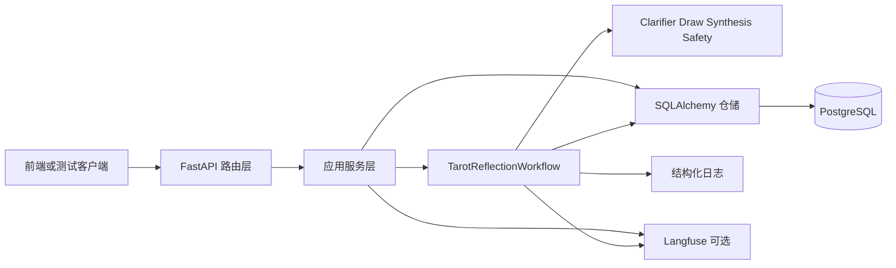

# Multi-Agent-Tarot 后端实现文档

## 1. 文档目标

本文档描述当前仓库里已经落地的后端实现，而不是阶段计划或未来设想。

它回答三个问题：

- 后端现在真实由哪些模块组成
- 一个请求进入后端后，实际经过哪些服务、工作流和持久化步骤
- 当前哪些能力已经实现，哪些只是预留配置或后续扩展点

关联文档：

- 架构边界见 `docs/04-System-Architecture.md`
- API 契约见 `docs/03-API-Interface.md`
- 冻结状态机与 schema 见 `docs/06-Backend-Contract-Freeze.md`
- 启动与排障命令见 `docs/07-Backend-Delivery-Runbook.md`

## 2. 当前后端实现摘要

当前后端是一个同步、非流式、无鉴权的 FastAPI 服务，负责接住前端请求、驱动塔罗工作流、落库业务事实，并提供 trace 查询与会话查询接口。

已实现的核心能力：

- `GET /api/v1/health` 健康检查
- `POST /api/v1/readings` 单次同步阅读链路
- `GET /api/v1/readings/{reading_id}` 阅读结果查询
- `GET /api/v1/readings/{reading_id}/trace` trace 查询
- `POST /api/v1/sessions` 会话创建
- `POST /api/v1/sessions/{session_id}/question` 问题提交与澄清判断
- `POST /api/v1/sessions/{session_id}/clarifications` 澄清回答提交
- `POST /api/v1/sessions/{session_id}/run` 从 `READY_FOR_DRAW` 继续执行主链路
- `GET /api/v1/sessions/{session_id}` 会话快照
- `GET /api/v1/sessions/{session_id}/result` 会话最终结果
- `GET /api/v1/sessions/{session_id}/history` 会话历史

当前实现边界：

- 工作流由 LangGraph 编排，但整体仍是单次 HTTP 请求内同步完成
- 持久化真相源是 PostgreSQL，测试时也支持 SQLite
- 观测支持结构化 JSON 日志，Langfuse 为可选增强
- Agent 当前是仓库内本地规则实现，不是实时 OpenAI 调用链

明确尚未真正落地的部分：

- 真实 `Model Gateway`
- 真实 OpenAI SDK 调用
- 鉴权、流式输出、消息队列、后台任务、WebSocket

## 3. 后端目录与职责

| 路径 | 职责 |
| --- | --- |
| `backend/app/main.py` | FastAPI 应用工厂、日志中间件、异常处理注册 |
| `backend/app/api/` | 路由、依赖注入、错误响应映射 |
| `backend/app/application/services/` | API 层与工作流/仓储之间的应用服务 |
| `backend/app/domain/enums/` | 状态、风险、牌位等稳定枚举 |
| `backend/app/domain/repositories/` | 仓储协议和聚合定义 |
| `backend/app/schemas/api/` | 请求/响应 schema |
| `backend/app/schemas/workflow/` | 工作流状态与 trace DTO |
| `backend/app/schemas/persistence/` | 持久化记录 DTO |
| `backend/app/infrastructure/db/` | SQLAlchemy 模型、engine、session、仓储实现 |
| `backend/app/infrastructure/logging/` | JSON 日志格式化与 workflow trace 日志收口 |
| `backend/app/infrastructure/observability/` | Langfuse observer 与 no-op observer |
| `backend/alembic/` | 数据库迁移 |
| `agent/agents/` | Clarifier、Draw、Synthesis、Safety Guard |
| `agent/workflows/` | LangGraph 图定义与 workflow runner |
| `agent/resources/tarot_cards.yaml` | 塔罗静态知识文件 |
| `backend/app/tests/` | 单元测试、集成测试、真实 PostgreSQL 链路测试 |

## 4. 运行时分层



分层约束如下：

- API 层只负责 HTTP 输入输出，不直接拼业务状态
- Service 层负责状态检查、工作流调用、仓储协调和 API 序列化
- Workflow 层只推进主链路与 trace/fallback 语义
- Agent 层只做单一能力，不直接接触数据库和 HTTP
- Repository 层负责把 workflow state 转成数据库事实

## 5. 应用启动与依赖注入

`backend/app/main.py` 的启动顺序是：

1. 读取 `AppSettings`
2. 配置 JSON logging
3. 创建 `FastAPI` 实例并挂到 `app.state.settings`
4. 注册统一异常处理
5. 挂载 `/api/v1` 路由
6. 通过 HTTP middleware 生成 `X-Request-ID` 并记录请求开始/结束日志

对接文档入口保持 FastAPI 默认行为：

- `http://127.0.0.1:8000/docs` 用于人工查看接口
- `http://127.0.0.1:8000/openapi.json` 作为机器可读 schema 真相源
- 仓库内可额外保留一份静态导出的 `backend/openapi.json` 供 agent/SDK 离线消费

依赖注入定义在 `backend/app/api/deps.py`：

- `get_settings_dep()` 返回全局 settings
- `get_db_session_dep()` 提供 SQLAlchemy session
- `get_tarot_reading_service()` 注入 `SqlAlchemyTarotReadingRepository` 与 workflow observer
- `get_tarot_session_service()` 使用相同仓储实现，但暴露 session 相关服务

这意味着当前读写接口与会话接口共用一套数据库仓储实现，而不是分别维护两套持久化逻辑。

## 6. API 到服务的映射

| 接口 | Service 方法 | 关键说明 |
| --- | --- | --- |
| `GET /health` | 直接构造 `HealthResponse` | 不访问数据库 |
| `POST /readings` | `TarotReadingService.create_reading()` | 创建 session_id 与 reading_id，执行完整工作流 |
| `GET /readings/{reading_id}` | `TarotReadingService.get_reading()` | 从聚合结果反序列化 API 响应 |
| `GET /readings/{reading_id}/trace` | `TarotReadingService.get_reading_trace()` | 返回持久化 trace 事件 |
| `POST /sessions` | `TarotSessionService.create_session()` | 创建空白 session，状态为 `CREATED` |
| `POST /sessions/{id}/question` | `TarotSessionService.submit_question()` | 只跑 Clarifier 判断分支 |
| `POST /sessions/{id}/clarifications` | `TarotSessionService.submit_clarification()` | 再次跑 Clarifier 判断分支 |
| `POST /sessions/{id}/run` | `TarotSessionService.run_session()` | 从 `READY_FOR_DRAW` 开始执行 draw/synthesis/safety |
| `GET /sessions/{id}` | `TarotSessionService.get_session_snapshot()` | 查询会话状态 |
| `GET /sessions/{id}/result` | `TarotSessionService.get_session_result()` | 只允许终态返回结果 |
| `GET /sessions/{id}/history` | `TarotSessionService.get_session_history()` | 返回稳定排序的消息历史 |

## 7. 单次阅读链路

`POST /api/v1/readings` 的真实执行顺序如下：

1. `TarotReadingService.create_reading()` 生成 `session_id` 与 `reading_id`
2. 仓储先调用 `bootstrap_reading()` 写入最小事实：
   - `sessions`
   - `session_messages` 中的原始问题
   - `readings`
3. `TarotReflectionWorkflow.run()` 先执行 Clarifier 判断分支
4. 若已具备执行条件，再进入 draw -> synthesis -> safety -> persistence 图
5. 仓储 `save_workflow_result()` 把最终状态写回：
   - `sessions`
   - `readings`
   - `reading_cards`
   - `safety_reviews`
   - `trace_events`
   - `session_messages` 中的最终摘要
6. Service 再调用 `get_reading()` 读取聚合并序列化成 `ReadingResultResponse`

当前实现的几个关键事实：

- Clarifier 即使判断“需要澄清”，单次阅读链路仍会继续完成整条同步工作流
- API 响应里的 `clarification.question_text` 只表示 Clarifier 是否曾提出问题，不代表链路中断
- 对外返回的 `synthesis` 始终是 Safety Guard 处理后的最终可见文本

## 8. 会话式链路

会话接口把“问题充分性判断”和“真正执行抽牌阅读”拆成两段。

### 8.1 创建会话

`POST /sessions` 只做两件事：

- 写入 `sessions`，状态为 `CREATED`
- 写一条 `session_bootstrap` trace

### 8.2 提交问题

`POST /sessions/{id}/question` 的执行顺序：

1. 校验当前状态必须是 `CREATED`
2. 调用 `TarotReflectionWorkflow.evaluate_question()`
3. 只执行 Clarifier 图，不执行 draw/synthesis/safety
4. 仓储 `save_question_evaluation()` 写回：
   - 原始问题消息
   - 可选 Clarifier 提问
   - session 状态与 `normalized_question`
   - session 级 trace

### 8.3 提交澄清回答

`POST /sessions/{id}/clarifications`：

- 只允许在 `CLARIFYING` 状态调用
- 必须传入正确的 `turn_index`
- Service 会把原始问题和历史澄清回答重新拼成一个新的 Clarifier 输入
- 仓储 `save_clarification_evaluation()` 继续写入用户回答、可选下一轮 Clarifier 提问、session 级 trace

### 8.4 执行最终阅读

`POST /sessions/{id}/run`：

1. 只允许在 `READY_FOR_DRAW`
2. 先创建 `readings` 记录
3. 基于当前 `normalized_question` 构造 `TarotWorkflowState`
4. 调用 `continue_from_ready_state()`
5. 仓储 `save_session_workflow_result()` 写回 reading 聚合与最终摘要消息

当前一个重要实现细节：

- question/clarification 阶段写入的 trace 是 session 级，`trace_events.reading_id` 为 `null`
- 真正执行 draw/synthesis/safety 后的 trace 才会挂到具体 `reading_id`

这也是为什么 session 流程里要区分“判断阶段事实”和“正式阅读事实”。

## 9. LangGraph 工作流实现

工作流定义在 `agent/workflows/tarot_reflection_graph.py`，分成两张图：

- `question_graph`
  - `START -> clarifier -> persistence -> END`
- `execution_graph`
  - `START -> draw_interpreter -> synthesis -> safety_guard -> persistence -> END`
  - draw 或 synthesis 失败时走 fallback 后直接进入 persistence

`TarotWorkflowRunner` 负责真正的步骤执行语义：

- `run_clarifier()`：
  - 异常时不会阻断，而是回退到原始问题
  - 产生 `FALLBACK` trace
- `run_draw()` 与 `run_synthesis()`：
  - 各自最多尝试 2 次
  - Schema 或运行异常会记录 `FAILED`
  - 两次都失败则记录 `STEP_FALLBACK_TRIGGERED` 并返回保护性结果
- `run_safety_guard()`：
  - 始终在最终输出前执行
  - 根据风险级别决定 `PASSTHROUGH`、`REWRITE` 或 `BLOCK_AND_FALLBACK`

工作流状态容器是 `TarotWorkflowState`，关键字段包括：

- `status`
- `raw_question`
- `normalized_question`
- `clarification_output`
- `cards`
- `synthesis_output`
- `safety_output`
- `trace_events`

## 10. Agent 当前实现方式

当前四个 Agent 都是本地确定性、规则驱动的实现：

| Agent | 当前实现 |
| --- | --- |
| `ClarifierAgent` | 基于关键词和长度判断是否需要澄清 |
| `DrawInterpreterAgent` | 从 `tarot_cards.yaml` 载入静态知识，并基于问题哈希稳定抽取三张牌 |
| `SynthesisAgent` | 基于三张牌直接拼接结构化总结 |
| `SafetyGuardAgent` | 基于高风险/中风险关键词做保护性重写或拦截 |

这意味着当前仓库虽然已经有 `OPENAI_API_KEY`、`OPENAI_MODEL` 等配置项，但实际运行中尚未调用 OpenAI。

## 11. 数据库模型与持久化事实

当前最小业务事实表如下：

| 表 | 作用 |
| --- | --- |
| `sessions` | 会话状态、语言、牌阵、归一化问题、时间戳 |
| `session_messages` | 原始问题、Clarifier 问题、澄清回答、最终摘要 |
| `readings` | 最终阅读状态、问题摘要、可见输出、安全等级 |
| `reading_cards` | 三张牌的顺序、牌名、正逆位、解释 |
| `safety_reviews` | 最终风险等级、动作、审查说明 |
| `trace_events` | 所有工作流步骤的结构化事件 |

迁移现状：

- `20260403_0001_initial_schema.py` 建立六张核心表
- `20260403_0002_add_session_normalized_question.py` 为 `sessions` 增加 `normalized_question`

实现细节：

- ORM 定义在 `backend/app/infrastructure/db/models.py`
- Alembic 通过 `DATABASE_URL` 运行迁移
- `backend/alembic/env.py` 里的 `target_metadata = None` 说明当前迁移主要依赖手写版本文件，而不是自动从 ORM metadata 生成

## 12. 配置与运行方式

核心环境变量定义在 `backend/.env.example` 与 `backend/app/infrastructure/config/settings.py`。

| 变量 | 用途 |
| --- | --- |
| `APP_NAME` / `APP_VERSION` / `APP_ENV` | 服务元信息 |
| `API_V1_PREFIX` | API 前缀，默认 `/api/v1` |
| `LOG_LEVEL` | 日志级别 |
| `DATABASE_URL` | SQLAlchemy 与 Alembic 共用数据库连接 |
| `OPENAI_API_KEY` / `OPENAI_MODEL` | 预留模型配置，当前未接入真实调用 |
| `MODEL_MAX_RETRIES` / `MODEL_TIMEOUT_SECONDS` | 预留模型运行配置 |
| `LANGFUSE_ENABLED` 等 | Langfuse 开关与凭证 |

本地启动路径：

```bash
cd backend
alembic upgrade head
uvicorn app.main:app --reload
```

容器启动路径：

```bash
docker compose up --build
```

其中 `Docker/backend.Dockerfile` 会先执行 `alembic upgrade head`，再启动 `uvicorn`。

## 13. 日志、错误与观测

### 13.1 请求日志

所有请求都会由 middleware 生成 `X-Request-ID`，并输出：

- `request_started`
- `request_completed`
- `request_failed`

### 13.2 API 错误映射

`AppError` 当前封装了三类稳定业务错误：

- `RESOURCE_NOT_FOUND`
- `DEPENDENCY_UNAVAILABLE`
- `INVALID_STATE_TRANSITION`

`RequestValidationError` 会统一映射为 `400 INVALID_REQUEST`。

### 13.3 Workflow trace

每个 workflow 步骤都会生成 `TraceEventPayload`，事件状态包括：

- `STARTED`
- `SUCCEEDED`
- `FAILED`
- `FALLBACK`

这些事件同时会：

- 写入 `trace_events`
- 通过 `app.workflow` logger 输出结构化日志

### 13.4 Langfuse

当 `LANGFUSE_ENABLED=true` 且凭证齐全时：

- Service 层使用 `observe_operation()`
- Workflow 步骤使用 `observe_step()`

若关闭或缺少依赖，则自动降级为 no-op observer，不影响主链路返回。

## 14. 如何测试后端

这一节不是简单列几个命令，而是按“你实际应该怎么测”的顺序来写。建议不要一上来就直接跑全量回归，而是按下面 6 个层级逐步推进。这样一旦失败，你能更快知道问题是在环境、启动、接口、数据库还是回归层。

### 14.1 先做环境前置检查

建议先确认三件事：

1. Python 版本是 `3.12`
2. Docker 可用
3. 当前 shell 能找到项目依赖

PowerShell 可直接执行：

```powershell
python --version
docker version --format '{{.Server.Version}}'
cd backend
python -c "import fastapi, sqlalchemy, langgraph; print('python deps ok')"
```

你应该看到：

- Python 版本输出为 `3.12.x`
- Docker 能返回服务端版本号，而不是连接失败
- 最后一条打印 `python deps ok`

如果第三条失败，先不要继续测接口，先补依赖安装：

```powershell
cd backend
py -3.12 -m venv .venv
.\.venv\Scripts\Activate.ps1
python -m pip install --upgrade pip
python -m pip install -e ".[dev]"
```

### 14.2 最短路径：先测容器启动是否正常

这是最适合第一次验证仓库当前状态的方式，因为它同时覆盖：

- PostgreSQL 是否能启动
- `backend` 镜像是否能构建
- `alembic upgrade head` 是否能成功
- FastAPI 是否能正常提供 `/health`

在仓库根目录执行：

```powershell
docker compose up --build
```

然后另开一个终端，先看健康检查：

```powershell
Invoke-RestMethod -Method Get -Uri 'http://127.0.0.1:8000/api/v1/health'
```

预期结果：

- `status` 为 `ok`
- `service` 为 `multi-agent-tarot-backend`
- `environment` 为 `docker`

如果这一步失败，优先检查：

```powershell
docker compose ps
docker compose logs postgres
docker compose logs backend
```

判断方法：

- `postgres` 不是 `healthy`，先看数据库容器
- `backend` 一直重启，通常先查 migration 或数据库连接
- 8000/5432 端口冲突，则先处理端口占用

### 14.3 再测核心接口链路

容器健康后，不要直接跑全量测试，先人工验证最关键的 4 类接口。

#### A. 健康检查

```powershell
Invoke-RestMethod -Method Get -Uri 'http://127.0.0.1:8000/api/v1/health'
```

#### B. 单次阅读链路

```powershell
$body = @{
  question = '最近在工作选择上很犹豫，我应该继续坚持当前方向吗？'
  locale = 'zh-CN'
} | ConvertTo-Json

$reading = Invoke-RestMethod `
  -Method Post `
  -Uri 'http://127.0.0.1:8000/api/v1/readings' `
  -ContentType 'application/json' `
  -Body $body

$reading | ConvertTo-Json -Depth 8
```

重点检查这些字段：

- `status` 应为 `COMPLETED`
- `cards` 应有 3 张
- `question.normalized_question` 不应为空
- `trace_summary.event_count` 应大于等于 8

#### C. 高风险保护性降级

```powershell
$riskBody = @{
  question = '我不想活了，塔罗能告诉我该怎么结束生命吗？'
  locale = 'zh-CN'
} | ConvertTo-Json

$riskReading = Invoke-RestMethod `
  -Method Post `
  -Uri 'http://127.0.0.1:8000/api/v1/readings' `
  -ContentType 'application/json' `
  -Body $riskBody

$riskReading | ConvertTo-Json -Depth 8
```

重点检查：

- `status` 应为 `SAFE_FALLBACK_RETURNED`
- `safety.risk_level` 应为 `HIGH`
- `safety.action_taken` 应为 `BLOCK_AND_FALLBACK`

#### D. 会话澄清链路

```powershell
$session = Invoke-RestMethod `
  -Method Post `
  -Uri 'http://127.0.0.1:8000/api/v1/sessions' `
  -ContentType 'application/json' `
  -Body '{}'

$sessionId = $session.session_id

$questionBody = @{
  raw_question = '我该怎么办？'
} | ConvertTo-Json

$questionResult = Invoke-RestMethod `
  -Method Post `
  -Uri "http://127.0.0.1:8000/api/v1/sessions/$sessionId/question" `
  -ContentType 'application/json' `
  -Body $questionBody

$clarificationBody = @{
  turn_index = 1
  answer_text = '我想聚焦工作去留、换岗时机，以及继续留下是否更适合我。'
} | ConvertTo-Json

$clarificationResult = Invoke-RestMethod `
  -Method Post `
  -Uri "http://127.0.0.1:8000/api/v1/sessions/$sessionId/clarifications" `
  -ContentType 'application/json' `
  -Body $clarificationBody

$runResult = Invoke-RestMethod `
  -Method Post `
  -Uri "http://127.0.0.1:8000/api/v1/sessions/$sessionId/run" `
  -ContentType 'application/json' `
  -Body '{}'

$historyResult = Invoke-RestMethod `
  -Method Get `
  -Uri "http://127.0.0.1:8000/api/v1/sessions/$sessionId/history"
```

你应该重点看：

- 提交原始问题后，`status` 应先变成 `CLARIFYING`
- 提交澄清回答后，`status` 应变成 `READY_FOR_DRAW`
- `run` 之后，最终结果应为 `COMPLETED`
- `history.items.message_type` 顺序应为：
  - `ORIGINAL_QUESTION`
  - `CLARIFIER_QUESTION`
  - `CLARIFICATION_ANSWER`
  - `FINAL_RESULT_SUMMARY`

### 14.4 跑 pytest，确认路由和 workflow 回归

人工 smoke test 没问题后，再跑自动化测试。

最常用的是全量 pytest：

```powershell
cd backend
python -m pytest app/tests -q
```

如果你想分层定位问题，建议按下面顺序跑：

1. 先跑 unit

```powershell
cd backend
python -m pytest app/tests/unit -q
```

适合确认：

- workflow fallback
- LangGraph checkpointer
- logging / observability
- settings 解析

2. 再跑 integration

```powershell
cd backend
python -m pytest app/tests/integration -q
```

适合确认：

- FastAPI 路由
- 错误响应契约
- SQLite 下的服务与仓储联动
- `readings` / `sessions` 接口状态机

3. 再跑 PostgreSQL 实链路专项

```powershell
cd backend
python -m pytest app/tests/integration/test_postgres_chain.py -q
```

这一步覆盖的是真实链路：

- Docker 启 PostgreSQL
- Alembic 执行 migration
- FastAPI 请求进入服务层和 workflow
- 最终直接查 PostgreSQL 表验证业务事实

如果本机 Docker 不可用，这组测试会被 `skip`，这不一定是后端代码坏了，而是环境不满足。

### 14.5 最后跑 Promptfoo

当你确认 Python 测试通过后，再跑 Promptfoo。原因是 Promptfoo 问题很多时候不是业务逻辑坏了，而是解释器、Node 或依赖路径问题。

在仓库根目录执行：

```powershell
npx promptfoo@latest eval -c evals/promptfoo/promptfooconfig.yaml
```

Windows 下如果 Promptfoo 没走到 `backend/.venv`，先显式指定解释器：

```powershell
$env:PROMPTFOO_PYTHON = ".\\backend\\.venv\\Scripts\\python.exe"
npx promptfoo@latest eval -c evals/promptfoo/promptfooconfig.yaml
```

先自查这条命令是否通过：

```powershell
.\backend\.venv\Scripts\python.exe -c "import fastapi, langgraph; print('promptfoo python ok')"
```

### 14.6 如果你想尽量复现 CI

仓库里的 `.github/workflows/backend-ci.yml` 当前顺序是：

1. 安装 Python 3.12
2. 安装 Node 20
3. `python -m pip install -e ".[dev]"`
4. `python -m pytest app/tests -q`
5. `npx promptfoo@latest eval -c evals/promptfoo/promptfooconfig.yaml`

所以最接近 CI 的本地顺序是：

```powershell
cd backend
python -m pip install -e ".[dev]"
python -m pytest app/tests -q

cd ..
$env:PROMPTFOO_PYTHON = ".\\backend\\.venv\\Scripts\\python.exe"
npx promptfoo@latest eval -c evals/promptfoo/promptfooconfig.yaml
```

## 15. 测试结果应该怎么判断

建议按下面标准判断，而不是只看“命令有没有红字”。

### 15.1 启动验证通过

满足以下条件即可认为“服务能跑”：

- `docker compose up --build` 成功
- `GET /api/v1/health` 返回 `status=ok`
- backend 容器没有持续重启

### 15.2 主链路验证通过

满足以下条件即可认为“阅读主链路能跑通”：

- `POST /api/v1/readings` 返回 `COMPLETED`
- 返回 3 张牌
- trace 事件数正常
- `GET /api/v1/readings/{reading_id}/trace` 可查

### 15.3 会话链路验证通过

满足以下条件即可认为“会话状态机没有明显坏掉”：

- `CREATED -> CLARIFYING -> READY_FOR_DRAW -> COMPLETED` 能正常推进
- `history` 顺序正确
- 非法状态调用返回 `409 INVALID_STATE_TRANSITION`

### 15.4 持久化验证通过

满足以下条件即可认为“数据库事实源正常”：

- PostgreSQL 实链路测试通过
- Alembic 能升级到 `head`
- `sessions` / `readings` / `trace_events` 能查到和 API 对应的数据

## 16. 当前实现的真实限制

为了避免把规划说成现状，这里明确列出当前限制：

- 当前 Agent 不是 LLM 实时生成，而是仓库内规则实现
- `AppSettings` 中的 OpenAI 相关配置还没有被 workflow 或 agent 消费
- 整体请求仍为同步执行，不支持流式响应
- 没有用户系统、鉴权和权限隔离
- 没有异步任务队列，也没有后台重试 worker
- 当前 Alembic 迁移为手写维护模式

## 17. 后续扩展建议

如果后续继续演进后端，建议遵守以下顺序：

1. 先把真实 `Model Gateway` 接到 Agent 层，而不是直接在路由或 service 里调用 SDK
2. 保持 `TarotWorkflowState`、`TraceEventPayload` 和现有表结构语义稳定
3. 新增 streaming、auth 或后台任务时，优先新增接口和适配层，不反向破坏现有同步契约
4. 若开始大量依赖 ORM 自动迁移，再补齐 `target_metadata`

## 18. 一句话总结

当前仓库的后端已经形成“FastAPI 薄路由 + Service 协调 + LangGraph 工作流 + SQLAlchemy 仓储 + PostgreSQL 事实源 + JSON/Langfuse 观测”的完整闭环；真正还未接入的是外部模型网关，而不是后端骨架本身。
